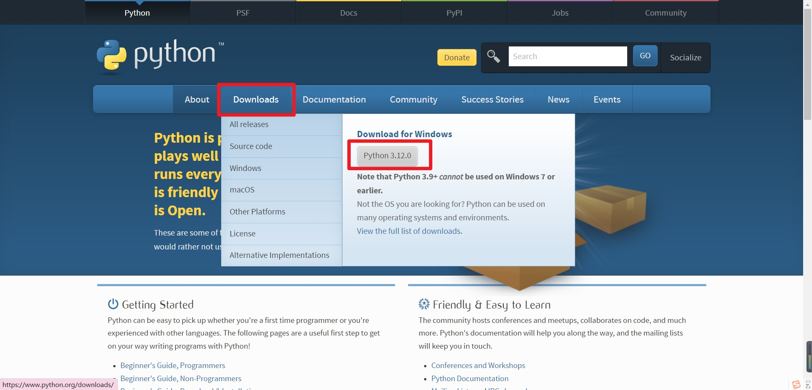
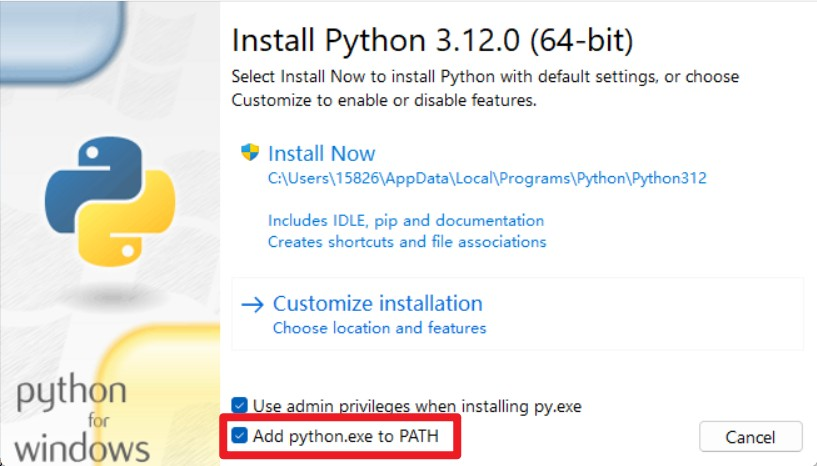
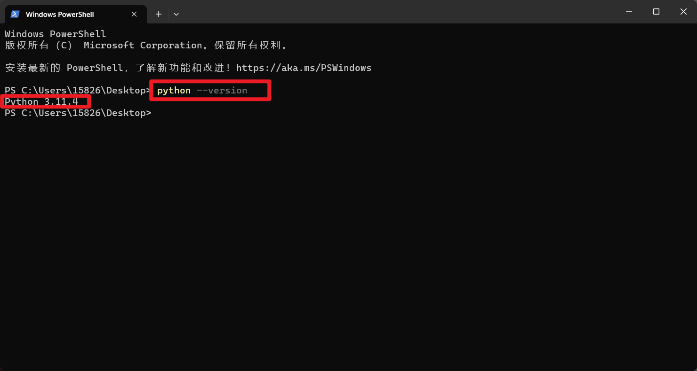

# 安装

关于如何安装 Python?我们以 `windows 操作系统` 为例：

首先，前往官网[https://www.python.org/](https://www.python.org/)，下载安装包。

然后，点击下载好的 `.exe` 文件，无脑地下一步、下一步……就好了。

不过，需要注意的是，记得勾选环境变量配置。

最后，打开你的终端面板，输入`python --version`。如果返回了 python 的版本号，就说明装好了。

